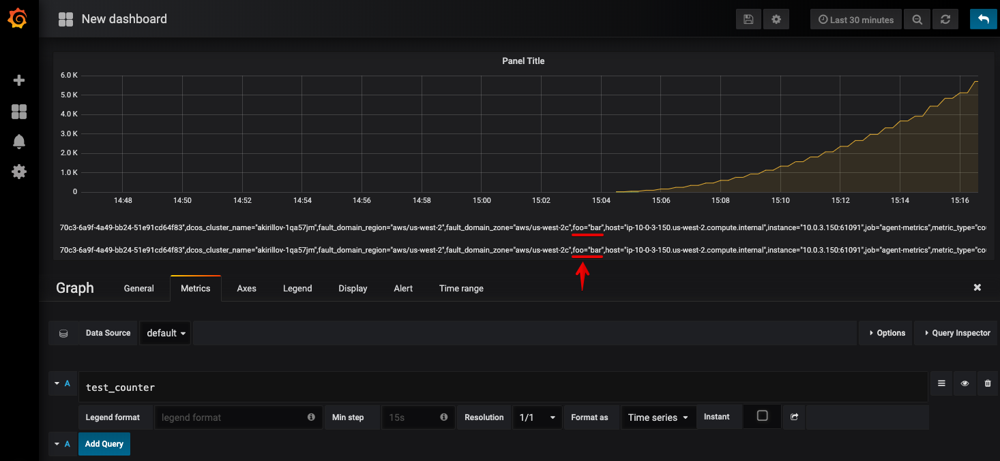

Test Application for StatsD metrics/tagging
---

# Overview

This application is intended to be used to verify StatsD reporter interplay with Telegraf/Prometheus on DCOS. `StatsdReporter`
class is borrowed from Spark codebase to simplify testing and verification of the reporter without introducing changes
to Spark itself.

The application is packed into a Docker image which can be later deployed to DCOS as Marathon application.

# Building
Prerequisites:
* Java
* Maven
* Docker

To build and push resulting Docker image run:
```
./build.sh <your dockerhub user>/<image name>:<tag>
```

# Marathon application

```
{
  "id": "/statsd-test",
  "cmd": "docker pull $DOCKER_IMAGE && docker run -e STATSD_UDP_HOST=$STATSD_UDP_HOST -e STATSD_UDP_PORT=$STATSD_UDP_PORT $DOCKER_IMAGE foo=bar",
  "cpus": 2,
  "mem": 2048,
  "disk": 0,
  "instances": 1,
  "acceptedResourceRoles": [
    "*"
  ],
  "env": {
    "DOCKER_IMAGE": "<your dockerhub user>/<image name>:<tag>"
    "DCOS_SERVICE_NAME": "statsd_test"
  },
  "portDefinitions": [
    {
      "port": 10002,
      "name": "default",
      "protocol": "tcp"
    }
  ],
  "maxLaunchDelaySeconds": 300
}
```

# Grafana
After deploying the application definition, `test_counter` metrics should appear in Grafana with `foo=bar` tag as 
specified in Marathon application `cmd` parameter:

 